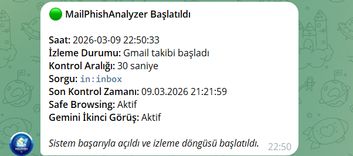
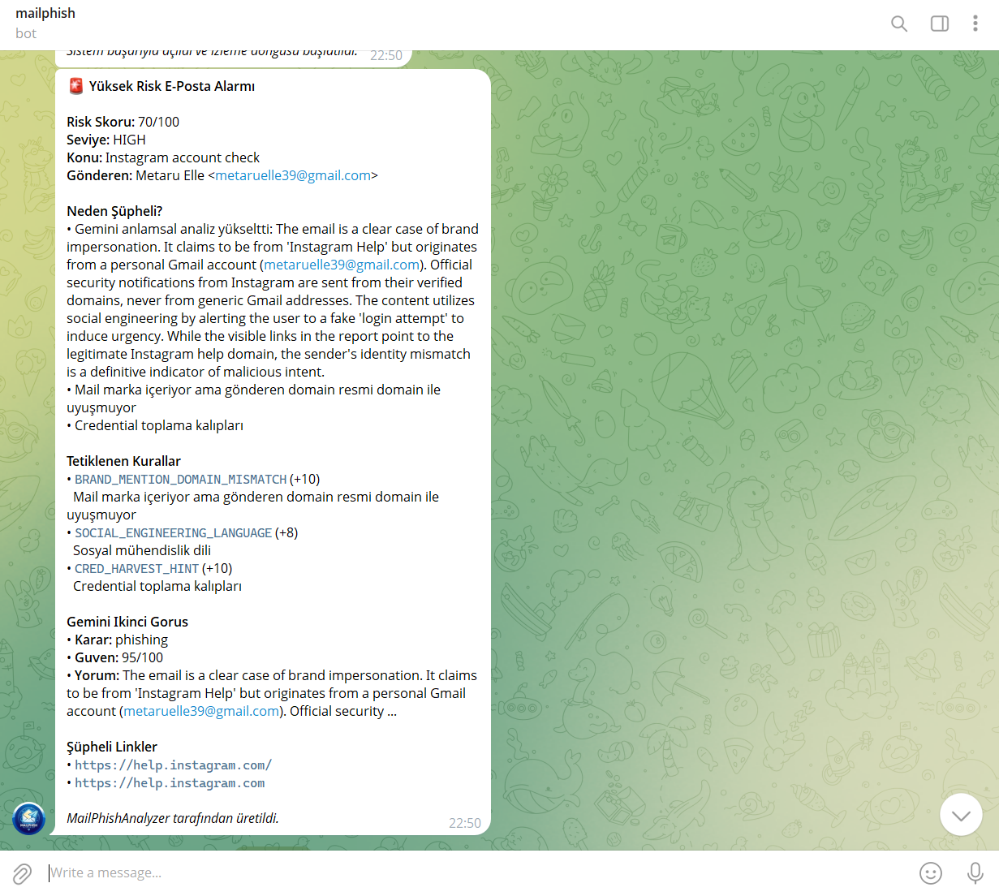
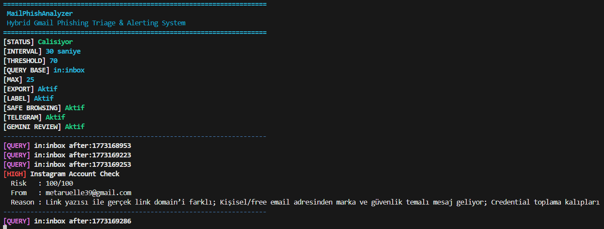

# MailPhishAnalyzer – Hybrid Gmail Phishing Triage & Alerting System

MailPhishAnalyzer is a hybrid Gmail phishing triage and alerting tool built with Python.

It combines:
- a **rule-based phishing detection engine**
- **Google Safe Browsing** threat intelligence
- **Gemini-based second review** for medium-risk emails
- **Telegram alerting**
- optional **Windows auto-start monitoring**

The goal of this project is not to replace enterprise email security products, but to provide an explainable and practical phishing triage system that can analyze emails, prioritize suspicious cases, and generate alerts automatically.

---

## Features

### Gmail Monitoring
- Connects to Gmail using the Gmail API
- Scans inbox emails continuously
- Tracks the **last scan time**
- Can continue analyzing emails that arrived while the system was offline

### Rule-Based Detection Engine
The analyzer checks multiple phishing indicators such as:
- sender spoofing signals
- Reply-To / Return-Path / Message-ID mismatches
- SPF / DKIM / DMARC issues
- brand impersonation
- visible link vs real link mismatch
- suspicious URL patterns
- lookalike domains
- social engineering language
- credential harvesting hints
- risky attachments
- mass-mail / BCC indicators

### Threat Intelligence
- Integrates with **Google Safe Browsing**
- Unsafe URL matches can immediately raise the risk level

### LLM-Assisted Second Review
- Uses **Gemini** only for **MEDIUM-risk** emails
- Rule engine remains the **main decision maker**
- Gemini acts as a second opinion to reduce false negatives and improve semantic judgment

### Telegram Alerting
- Sends alerts for **HIGH-risk** emails
- Telegram messages include:
  - risk score
  - triggered rules
  - suspicious links
  - Gemini second review summary when applicable

### Auto-Start / Background Monitoring
- Can be configured to start automatically on Windows login
- Supports hidden background startup through Task Scheduler

### Reporting
- Exports per-email JSON reports
- Stores daily scanning summaries
- Keeps scan state across restarts

---

## Detection Categories

The rule engine uses multiple categories to calculate a final risk score.

### 1. Sender Identity / Spoofing
- From vs Reply-To mismatch
- From vs Return-Path mismatch
- Message-ID mismatch
- Brand-like sender names on free-email domains
- Brand mention with unrelated sender domain

### 2. Authentication
- SPF fail
- DKIM fail
- DMARC fail
- SPF/DKIM alignment mismatch

### 3. Link Analysis
- Visible link text differs from actual destination
- Lookalike domains
- Suspicious URL patterns
- URL shorteners
- Obfuscated URLs
- Punycode / IP-based URLs

### 4. Content Analysis
- Social engineering language
- Credential harvesting hints
- Empty or very short subject lines

### 5. Attachment Risk
- Dangerous file extensions
- Macro-enabled Office files
- Double extensions
- Suspicious archive patterns

### 6. Behavioral Signals
- Mass recipient patterns
- BCC usage

### 7. Threat Intelligence
- Google Safe Browsing unsafe URL match

### 8. Allowlist Support
- Trusted domains
- Trusted sender addresses
- Allowlist only reduces risk when no strong malicious indicator exists

---

## Hybrid Decision Logic

This project uses a layered decision model:

1. **Rule engine** performs the initial phishing analysis
2. **Google Safe Browsing** enriches link reputation
3. If the email is **MEDIUM risk**, **Gemini** performs a second review
4. If the final result is **HIGH**, a **Telegram alert** is sent

This makes the system more realistic than a simple keyword-based detector.

---

## Project Structure

```bash
mailphish_analyzer/
│
├── analyzer.py
├── app.py
├── gmail_client.py
├── llm_client.py
├── reporter.py
├── safe_browsing_client.py
├── telegram_alert.py
├── requirements.txt
├── allowlist.json
├── README.md
│
├── reports/
├── credentials.json
├── token.json
├── state.json
├── task_log.txt
├── run_mailphish.bat
└── run_mailphish_hidden.vbs
```


## Screenshots

### Startup Message
Shows that the monitoring service started successfully and resumed from the last scan time.



### Telegram Alert
Example of a high-risk phishing alert with triggered rules and Gemini second review.



### Running System
Terminal view of the running phishing triage engine.




## Installation

### 1. Clone the repository
```bash
git clone [https://github.com/beratkrmn7/MailPhishAnalyzer.git](https://github.com/beratkrmn7/MailPhishAnalyzer.git)
cd MailPhishAnalyzer
2. Install dependencies
Bash
pip install -r requirements.txt
3. Gmail API Setup
You need:

A Google Cloud project

Gmail API enabled

OAuth Desktop Client credentials

A credentials.json file in the project folder

Note: On the first run, the script opens a browser and requests Gmail access.

4. Optional API Integrations
You can also configure:

Google Safe Browsing API

Gemini API

Telegram Bot API

Environment Variables
Example PowerShell setup:

PowerShell
$env:SAFE_BROWSING_API_KEY="YOUR_SAFE_BROWSING_API_KEY"
$env:TELEGRAM_BOT_TOKEN="YOUR_TELEGRAM_BOT_TOKEN"
$env:TELEGRAM_CHAT_ID="YOUR_TELEGRAM_CHAT_ID"
$env:GEMINI_API_KEY="YOUR_GEMINI_API_KEY"
Usage
Basic run:

Bash
python app.py --interval 30 --export --query "in:inbox"
With Gmail labels:

Bash
python app.py --interval 30 --export --label --query "in:inbox"
Important Arguments
--interval → Scan interval in seconds

--query → Gmail search query

--export → Export JSON message reports

--label → Apply Gmail labels

--threshold → Alert threshold

Example Workflow
A new email arrives in Gmail.

Rule engine analyzes headers, content, links, and attachments.

Safe Browsing checks suspicious URLs.

If the result is MEDIUM, Gemini reviews the case.

If the final severity is HIGH, Telegram sends an alert.

A JSON report is saved locally.

Why This Project Matters
Phishing is not just about bad keywords. Real phishing emails often combine:

Impersonation

Social engineering

Trust abuse

Suspicious links

Deceptive formatting

Malicious attachments

This project tries to model phishing detection more realistically by combining:

Rule-based analysis

Threat intelligence

LLM-assisted review

Real-time alerting

Limitations
This tool is useful as a phishing triage assistant, but it is not a perfect phishing detector. Known limitations:

False positives are still possible.

Sophisticated phishing may still bypass detection.

Attachment analysis is based mostly on metadata / filename heuristics.

Safe Browsing only catches known unsafe URLs.

LLM review depends on external API behavior and may not always be correct.

Disclaimer: This project should be treated as a decision support system, not a final authority.

Future Improvements
Better allowlist / trust modeling

Dedicated marketing/newsletter logic

Attachment hash reputation lookup

URL sandboxing

Domain age / WHOIS enrichment

Dashboard UI

Support for additional email providers

Improved calibration using larger phishing datasets

Technologies Used
Python

Gmail API

Google Safe Browsing API

Gemini API

Telegram Bot API

BeautifulSoup

Author
Berat Karaman

Built as a cybersecurity portfolio project focused on:

Phishing detection

Email triage

Alert automation

Hybrid rule + LLM analysis

email triage

alert automation

hybrid rule + LLM analysis
